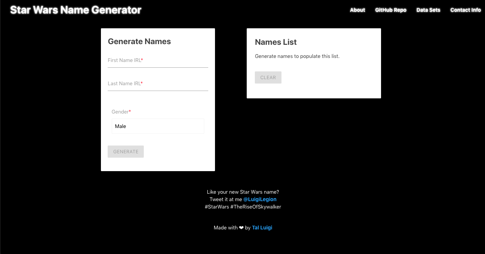

# Star Wars Name Generator

### Video Presentation:

Coming soon...

### Deployed Web App:

https://star-wars-name-generator.web.app

### Description:

Responsive web app that allows users to find their very own Star Wars name based on their name in real life out of a little over 22,000 first names and 10,000 last names from both Canon and Legends by utilizing a set of matching algorithms.

MVP completed in 4 days for a solo project.

### Tech Stack:

Built using React, Redux, Materialize.css, and the Wikia API.

### Dev Team:

- Tal Luigi ([LinkedIn](https://www.linkedin.com/in/talluigi) | [GitHub](https://github.com/luigilegion))
